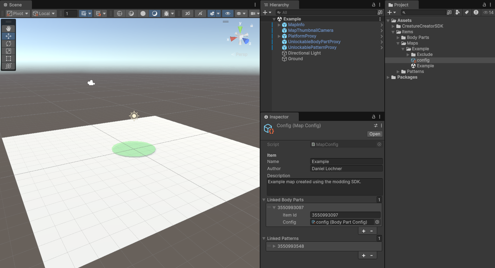

Welcome to the **Creature Creator SDK** — the official toolkit for building and distributing mods for Creature Creator, including maps, body parts, and patterns.
This guide will walk you through installation, testing examples, creating mods, and uploading them to the Steam Workshop.

# 🚀 Installation
1. First, download [Unity 6000.1.12](https://unity.com/releases/editor/whats-new/6000.1.12) and the [latest version of the SDK](https://github.com/daniellochner/creature-creator-sdk/releases)!
2. Open Unity Hub, and create a new project by selecting **Unity 6000.1.12** and then scrolling down to the **"3D (Built-In Render Pipeline)"** template. Enter a name and then click the button to create your project.
3. Drag-and-drop the SDK Unity package into your project files, and then click the "Import" button to add it to your project. To update the SDK, you can follow the same process.
Great! You are now all setup and ready to get started!

# 🧪 Testing the Examples

Before we begin creating our own mods, let's test the examples to see if everything is working as expected.
1. Go to your project window and double click on the `Example.unity` scene file in `Assets/Items/Maps/Example/` to load the example map.
2. Next, select the config file and navigate to the top menu bar again and click on "Creature Creator > Build and Test". This will start the build process for the map, as well as the unlockable part and pattern, which are referenced as dependencies in the config file.
3. Once completed, the executable will be launched with command-line arguments pointing to your mod! Note that if the executable cannot be found, click "Creature Creator > Locate Creature Creator.exe". The application should be installed in the `~/Steam/steamapps/common/` directory.
The game should now open and load the example map in Adventure mode!

# 🎨 Creating Mods
Now that you know everything is working as expected, let's create a new mod!
1. Navigate to to the top menu bar and select "Creature Creator > New", and choose a name!
2. This will create a new folder for your mod and select the config file. This config has properties that are relevant to the type of mod that was created.
There are three types of mods, namely: [Body Barts](##body-parts), [Patterns](##patterns) and [Maps](##maps). Each follows a similar setup process.

## Body Parts
1. Drag-and-drop your model file into your part's newly generated folder.
2. In the mesh import settings of your model, enable `Read/Write` mode! This is necessary for the outline effect to be rendered.
3. Next, double click on the prefab and drag-and-drop your model (from Unity) into it. Remember to delete the previous "Model" game object in the prefab.
4. You now have a basic, functional body part, but let's enhance it with some additional features.
   - **Materials**: If you would like the materials to be colourable, you can name them "Body_Primary" or "Body_Secondary" to use the body's primary or secondary colours by default respectively. These materials can then be overidden from the paint menu in-game.
   - **Transformations**: You can also create custom stretch blend shapes/shape keys in your 3D modelling software. For each axis, a positive and negative blend shape must be defined. So, if you would like stretch transformations on the X and Y axes, you need to name them "+X", "-X", "+Y" and "-Y". Note that you can also swap the axis and sign, or use lowercase (i.e., "Z+" or "z-" both work as well).
   - **Limbs**: Limbs are a special case and need to follow the correct structure! There should be an empty parent with two children, namely the "Model" (with the Skinned Mesh Renderer) and "Root" (with all the bones as children). You can also add blend shapes for each bone in the limb.

## Patterns
Patterns are quite simple to add! To simplify the process, just open up the template image in your pattern's newly generated folder and edit it, or copy and paste from an existing image.

## Maps
1. Double click the Unity scene file in your map's newly generated folder to load into your map. In order to build and test a map, please note that the config file must be selected and the scene should be loaded!
2. Now that you are loaded in, you can edit the map as you would a normal scene in Unity! All the tools that exist in Unity are available at your disposal, however, custom scripts are not allowed and certain components have been blacklisted to prevent exploits.
3. Functionality is added to your maps by adding proxies (in `Assets/CreatureCreatorSDK/Toolkit/Prefabs`) to your scene and editing their properties.
   - **Thumbnail**: Reposition the `MapThumbnailCamera` game object in the scene. This camera will be used to render the thumbnail at build time.
   - **Minimap**: Select the `MapInfo` game object in the scene and then view from above. Assign your rendered image and then set the size to ensure it fits to your map.
   - **Platforms**: Drag-and-drop the platform proxy into the scene. The first platform in the hierarchy will be the default spawn point.
   - **Unlockable Parts and Patterns**: Drag-and-drop the unlockable item proxies into the scene and then set their item Ids to match their file Ids in the Steam workshop (e.g., [3550993097](https://steamcommunity.com/sharedfiles/filedetails/?id=3550993097)). For testing, you can also use an arbitrary Id, and then add a link to the local item in the map's config file.
   - **Water**: Drag-and-drop the water proxy prefab in the scene and position it to fit over the water in your map.
   - **Dark Area**: Drag-and-drop the dark area prefab into the scene to ensure creatures use bioluminescent parts in certain areas.

# ☁️ Uploading Mods to the Workshop
Fantastic! You should now have a custom body part, pattern or map that has been tested, and is ready to upload to the Steam workshop!
1. Before you can upload, you'll need to make sure that all the required modules are installed via Unity Hub for the different platforms, including:
   - Windows Build Support (Mono)
   - Mac Build Support (IL2CPP)
   - Linux Build Support (Mono)
   - iOS Build Support
   - Android Build Support
2. Now, with your mod's config selected, navigate to the top menu and click on "Creature Creator > Upload to Workshop".
This will launch the game and begin the upload process, and once complete, open the Steam workshop to your newly uploaded mod!

# 💬 Need Help?
If you need any help, please feel free to send a message on the community Discord server! I'm looking forward to seeing your mods in-game!
