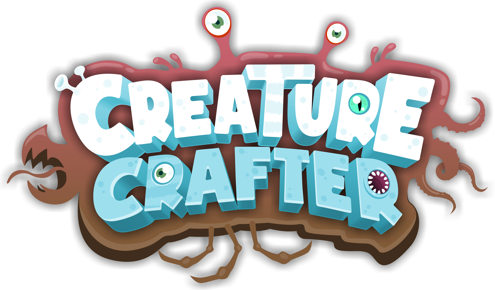

Here is a guide on how to create mods for Creature Creator!

# Installation
1. First, download [Unity 6000.1.12](https://unity.com/releases/editor/whats-new/6000.1.12) and the [latest version of the SDK](https://github.com/daniellochner/creature-creator-sdk/releases)!
2. Open Unity Hub, and create a new project by selecting **Unity 6000.1.12** and then scrolling down to the **"3D (Built-In Render Pipeline)"** template. Enter a name and then click the button to create your project.
3. Drag and drop the SDK Unity package into your project files, and then click the "Import" button to add it to your project. If you ever need to update the SDK. you can follow the same process.
Great! You are now all setup and ready to get started!

# Getting Started
Before we begin creating our own mods, let’s test the examples to see if everything is working as expected!
1. Go to your project window and double click on the "Example" scene file in "Assets/Items/Maps/Example" to load the example map.
2. Next, select the config file and navigate to the top menu bar again and click on "Creature Creator > Build and Test". This will start the build process for the map, as well as the unlockable part and pattern, which are referenced as dependencies in the config file!
3. Once completed, the executable will be launched with command-line arguments pointing to your mod! Note that if the executable cannot be found, click "Creature Creator > Locate Creature Creator.exe". The application should be installed in the "~/Steam/steamapps/common/" directory.
The game should then open and load the example scene in adventure mode!

# Creating Mods
Now that you know everything is working as expected, let's begin by creating a new mod!
Navigate to to the top menu bar and select "Creature Creator > New", and choose a name! This will create a new folder for your mod and select the config file.
There are three types of mods, namely: [Body Barts](##body-parts), [Patterns](##patterns) and [Maps](##maps). While different, they each follow a similar process to setup.

## Body Parts
1. Drag your model file into your folder.
2. In the import settings of your model, enable "Read/Write mode"! This is necessary for the outline effect to be rendererd.
3. Next, double click on the prefab and drag and drop your model (from Unity) into it. Remember to delete the previous "Model" game object in the prefab.
4. You now have a basic body part that should work fine, but let's add some more interesting functionality!
  4.1. Materials: If you would like the materials to be recolourable, you can name them "Body_Primary" or "Body_Secondary" to use the body's primary or secondary colours by default respectively. These materials can then be overidden from the paint menu in-game.
  4.2. Transformations: You can also create custom stretch blend shapes/shape keys in your 3D modelling software. For each axis, a positive and negative blend shape must be defined. So, if you would like stretch transformations on the X and Y axes, you need to name them "+X", "-X", "+Y" and "-Y". Note that you can also swap the axis and sign, or use lowercase (i.e., "Z+" or "z-" both work as well).
  4.3. Limbs: Limbs are a special case and need to follow the correct structure! There should be an empty parent with two children, namely the "Model" (with the Skinned Mesh Renderer) and "Root" (with all the bones as children). You can also add blend shapes for each bone in the limb, which can be named "Bone.0", "Bone.1", etc.

## Patterns
Patterns are quite simple to add! To simplify the process, just open up the generated template file and edit it, or copy and paste from an existing image.

## Maps
1. Firstly, double click the unity scene file to load into a map. In order to build and test a map, the config file must be selected and the scene should be loaded!
2. Now that you are loaded in, you can edit the map as you would a normal scene in Unity! All the tools that exist in Unity are available at your disposal, however, certain components have been blacklisted to prevent exploits, and custom scripts are not allowed.
3. The easiest way to get started is by looking at the example and seeing how it is done!
  3.1. Thumbnail: Select and reposition the thumbnail camera in-scene. The thumbnail will be generated at build time.
  3.2. Minimap: Select the minimap info in-scene and then view from the top. Assign your image of the minimap in the component. You can then scale the root game object to ensure it fits to your map.
  3.3. Platforms: Drag-and-drop the platform proxy prefab into the scene. The first one in the hierarchy will be the default spawn point.
  3.4. Unlockable Parts and Patterns: Drag-and-drop the unlockable item proxies into the scene. You will then need to set the item Ids to match their file Ids in the Steam workshop. For testing, you can also use an arbitrary Id, and then setup the link to the local item in the map's config file.
  3.5. Water: Drag-and-drop the water proxy prefab and position it to be over your water.
  3.6. Dark Area: Drag-and-drop the dark area prefab into the scene to ensure creatures’ use bioluminescent parts in certain areas.

# Uploading Mods to the Workshop
Fantastic! You should now have a custom body part, pattern or map that has been tested, and is ready to uplod to the Steam workshop!
1. Before you can upload, you'll need to make sure that all the required modules are installed via Unity Hub for the different platforms. This includes "Windows Build Support (Mono)", "Mac Build Support (IL2CPP)", "Linux Build Support (Mono)", "iOS Build Support" and "Android Build Support".
2. Now you can navigate to the top menu bar again with your mod's config selected and click on "Creature Creator > Upload to Workshop".
This will launch the game and begin the upload process, and once complete, open the Steam workshop for your mod!

Hope this helps! If you need any help, please feel free to send a message on the community Discord server! I'm looking forward to downloading your mods in-game!

Thanks!
