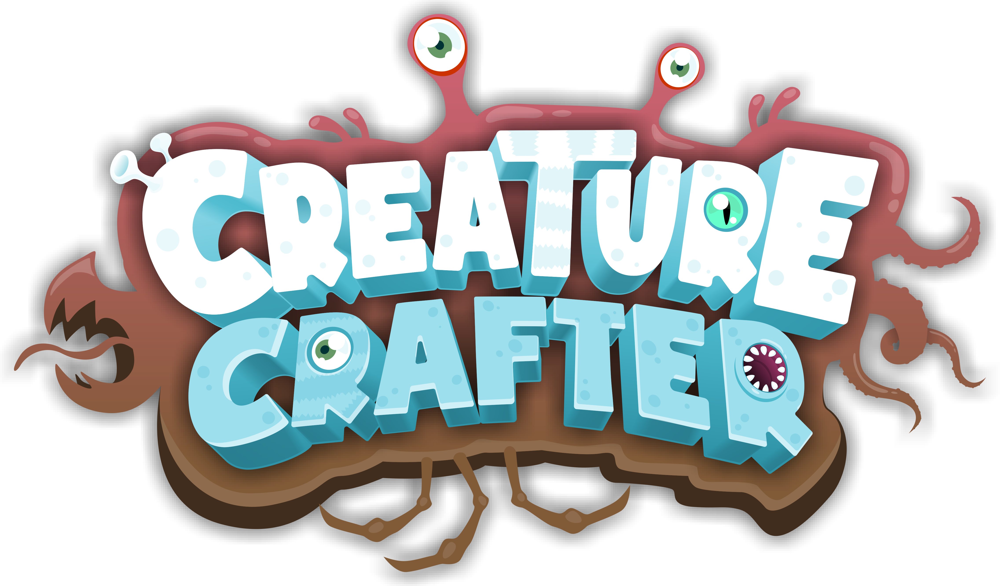

Welcome to the **Creature Creator SDK** — the official toolkit for building and distributing mods for Creature Creator, including maps, body parts, and patterns.
[This](https://steamcommunity.com/sharedfiles/filedetails/?id=3555683698) guide on Steam will walk you through installation, testing examples, creating mods, and uploading them to the workshop.

If you need any help, please feel free to send a message on the community Discord server! I'm looking forward to seeing your mods in-game!